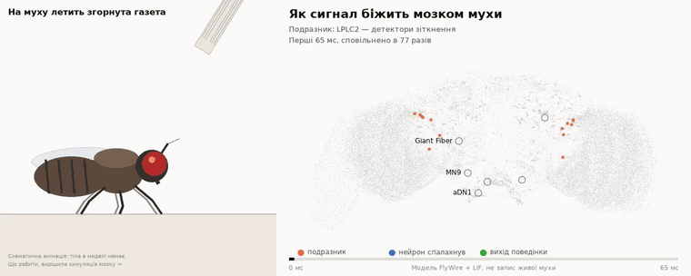
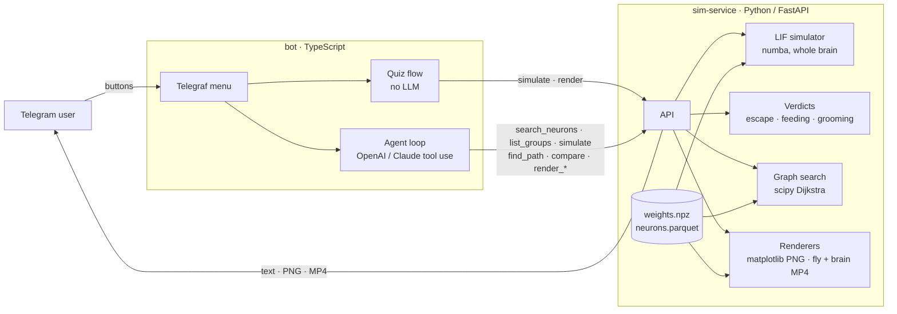
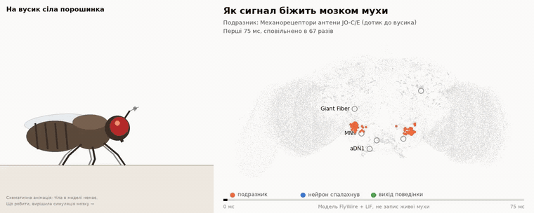
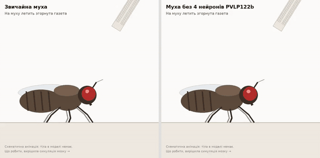
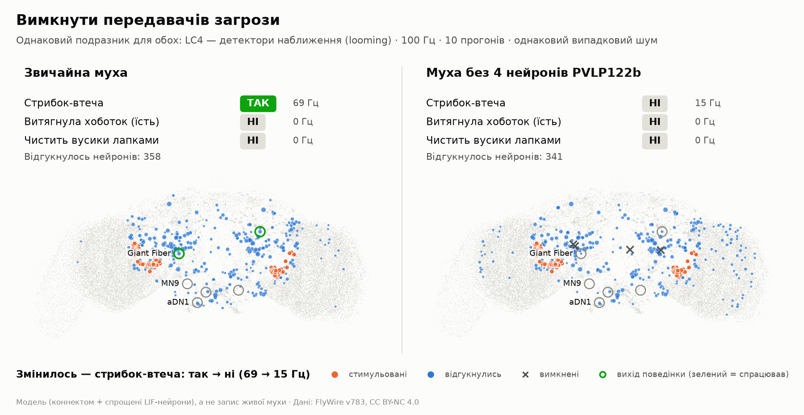

# 🪰🧠 Fly Brain Bot

**A Telegram bot that runs a spiking simulation of the real fruit-fly connectome and shows what the fly does — and why — in Ukrainian, with animations.**



*Left: a schematic fly. Right: its brain — 138,639 neurons from FlyWire, simulated. The fly takes off at the moment the Giant Fiber neuron fires in the simulation (~7 ms after the looming detectors).*

*[Українська версія нижче](#-українською)*

---

## What it shows

- **Scientific data at scale** — the FlyWire v783 connectome (CC BY-NC 4.0) turned into a 49 MB sparse matrix + annotated neuron table; neuron groups are resolved from annotations, never hard-coded IDs.
- **A fast, validated simulator** — Python/FastAPI with a numba re-implementation of the Shiu et al. 2024 LIF model: a whole-brain run in 0.3–2.5 s, **spike-for-spike identical to naive stepping** (test-proven), reproducing the paper's feeding, bitter-suppression and grooming results.
- **Answers you can check** — what the fly did is computed **by code** from three validated output neurons; an LLM only explains it. "Break the fly" proves causality: same stimulus, one change in the brain, different behaviour.
- **An LLM agent with tools** — a hand-written tool-use loop with switchable providers (OpenAI Responses API or Anthropic Messages API): 7 tools with strict JSON schemas, iteration cap, timeouts, graceful tool errors, prompt caching, per-user quota, JSON logs with token usage.
- **A Telegram bot driven only by buttons** — TypeScript + Telegraf; a game, before/after experiments, MP4 animations.
- **Deployment** — docker-compose, data fetched on first start.

## Architecture



## The bot

There are no commands and no free text — only buttons (a persistent menu plus inline choices). Typed messages just bring the menu back.

| Menu | What happens | LLM |
|---|---|---|
| 🎲 **Вгадай, що зробить муха** | Pick an experiment (newspaper, sugar, sugar + bitter, bitter, dust on the antenna), guess what the fly does (🛫 / 🧊 / 🍽 / 🧹 / 🤷), then a fixed simulation runs and code judges the guess. | no |
| 🔧 **Зламати муху** | Three validated before/after experiments: the same stimulus for a normal and a changed brain, two flies side by side. | explains |
| 🔬 **Досліди** | Fixed questions answered by the agent with simulations and path search (daily limit). | yes |
| ℹ️ **Про бота** | What it is, limitations, sources. | no |

Every simulation answer starts with a block computed by code:

```
🪰 Що зробила муха:
🦵 Стрибок-втеча — ТАК
👅 Витягнула хоботок (їсть) — НІ
🧹 Чистить вусики лапками — НІ
🧠 Задіяно 582 нейрони з 138 639 — це 0,4 % мозку
```

Three taps from `/start`: what the fly did → how the signal ran → what changed when the brain was broken.

## The model

| | |
|---|---|
| Connectome | FlyWire FAFB v783, adult female brain: **138,639 neurons, 15.1M connections, 54.5M synapses** |
| Neuron model | Leaky integrate-and-fire, parameters from Shiu et al. 2024 (`v_rest −52 mV`, `v_th −45 mV`, `τ_m 20 ms`, `τ_syn 5 ms`, `t_ref 2.2 ms`, delay 1.8 ms, 0.275 mV/synapse) |
| Synapse sign | by predicted neurotransmitter: ACh excitatory, GABA/Glu inhibitory (signs from the Shiu edge list) |
| Stimulus | Poisson input at a chosen rate to a group of neurons |
| Output | mean firing rate per neuron over 10 trials × 1 s; verdicts; spike times of one trial for animation |

### Making it fast enough for a chat

Brian2 needs minutes per whole-brain run. Here a request (10 trials × 1 s of brain time, 4 threads in Docker) takes **0.3 s for sugar, 1.5–2.5 s for looming**, at most ~5 s for runaway cases:

- The ODE is linear, so it is integrated exactly (as Brian2 `method='linear'` does).
- **Lazy neurons**: the free trajectory `u(s) = A·e^{−s/τ} + (u₀−A)·e^{−s/τ_m}` has a closed-form maximum. A neuron whose maximum stays below threshold cannot spike until new input arrives, so it is not stepped at all; its state is advanced analytically when the next spike reaches it. Only neurons that *can* fire are stepped every 0.1 ms. No approximation — `tests/test_sim_kernel.py` checks spike-for-spike equality with naive stepping.
- Spike delivery dominates, so it is cache-friendly: per-neuron state packed into one row, decay factors from a table instead of `exp`, a cheap bound `u ≤ max(u₀,0) + g₀·τ/τ_m` before the exact check, and inhibitory input skips the check entirely.
- Trials run in parallel threads (numba `nogil`).
- Seizure-like activity (e.g. all GABA neurons silenced: ~25k neurons firing at up to 300 Hz) is cut off by a synaptic-event budget (`SIM_MAX_OPS`); rates are computed over the simulated window and the result is flagged.

### Validation

Reproducing Shiu et al. 2024 on v783 (`tests/test_validation.py`, `tests/test_behavior.py`):

| Experiment | Result |
|---|---|
| Sugar GRNs (the paper's 21 IDs, 20 still exist in v783) at 25/50/100/150/200 Hz → MN9 | 0 / 12 / 70 / 96 / 113 Hz — sigmoid dose-response ✅ |
| Responding neurons | ~400 (paper: "about 400") ✅ |
| Bitter GRNs alone → MN9 | 0 Hz ✅ |
| Sugar + bitter (100 Hz) → MN9 | 70 → 1.9 Hz, bitter suppresses feeding ✅ |
| LPLC2 / LC4 → Giant Fiber (DNp01) | activated ✅ |
| Antennal mechanosensors JO-C/E at 60/100/150/220 Hz → aDN1 (Fig. 5) | 0 / 7 / 33 / 56 Hz; JO-F: 0 ✅ |

A detail worth knowing: the 2026 re-annotation of gustatory neurons (Tastekin et al.) classifies 7 of the paper's 18 "water" GRNs as sugar-sensing — which explains why water activated MN9 in the original model. The bot's groups use the current annotations.

### Behaviour verdicts

Only output neurons validated in Shiu et al. 2024 are used: **escape** = Giant Fiber (DNp01), **feeding** = MN9, **grooming** = aDN1 (DNg62), the descending command for antenna cleaning (Hampel et al. 2015). A behaviour is "yes" when the stronger neuron of the pair fires ≥ **30 Hz** ([behaviors.yaml](sim-service/app/behaviors.yaml)); the threshold sits in the gap seen in validation runs:

| Output | "No" cases | Weak (→ "ні, слабкий сигнал") | Clear "yes" |
|---|---|---|---|
| MN9 | bitter 0, water 0, sugar @25 Hz 0, sugar + bitter 0.4–6.6 Hz | sugar @50 Hz 20, right-side sugar 18 | sugar @75 Hz 49, @100 Hz 75, @150 Hz 90–96 |
| Giant Fiber | sugar, bitter, water 0 | LC4 @25 Hz 19 | LC4 @50 Hz 36, @100 Hz 69, LPLC2 140–212 |
| aDN1 | sugar, bitter, water, LPLC2, LC4, GABA silenced 0; JO-F @60–220 Hz 0 | JO-C/E @100 Hz 7 | JO-C/E @150 Hz 33, @220 Hz 55–57 |

If the output neurons were stimulated directly, the verdict says it proves nothing. More than 5,000 responding neurons is flagged as runaway. There is **no separate flight, walking or freezing output** in the model: flight is shown only as the continuation of the Giant Fiber take-off, and "freeze" in the game is answered with "the model can't measure that".

### Animation — the fly and its brain, in sync



**Right — the brain.** Neurons flash on a frontal projection (FlyWire `pos_x / pos_y`) as they spike in one simulated trial; neurons that already fired stay faintly lit, so the wave of recruitment is visible; Giant Fiber, MN9 and aDN1 turn green when they fire. The window is the recruitment phase (until 75 % of responding neurons first fired, at least until an output fired), 40–150 ms, slowed down 40–80×.

**Left — a schematic fly.** The model has no body, so the fly is a drawing (Pillow, side view). But *whether* it acts is the code verdict, and *when* is the first spike of the behaviour's output neuron in that trial:

| Verdict | Fly | Prop (illustrates the stimulated sensors) |
|---|---|---|
| escape | legs push, wings open, take-off and flight away | a rolled newspaper (LPLC2 / LC4) |
| no escape under the newspaper | flattened under it: "Giant Fiber не спрацював → не встигла злетіти" | |
| feeding | proboscis extends to the drop, the drop shrinks | sugar / bitter / mixed drop |
| grooming | front legs sweep the antenna and rub each other, the dust falls off | dust on the antenna (JO-C/E) |
| none | stays put, "no behaviour fired" | |

The frame says so: "Схематична анімація: тіла в моделі немає. Що робити, вирішила симуляція мозку →".

`POST /render/animation` → H.264 MP4 for Telegram `sendAnimation`: 1200×480, 15 fps, 7 s, 70–180 KB, **3–4 s to render in Docker** (static parts drawn once; per frame only precomputed glow sprites are stamped; the fly is drawn at 2× and downsampled; ffmpeg comes from `imageio-ffmpeg`). If rendering fails or exceeds `ANIMATION_TIMEOUT_MS`, the bot sends the static PNG only.

### "Break the fly" — cause and effect



The same stimulus and random seed for a normal brain and a changed one. `POST /compare` returns both verdicts and what changed; `/render/compare_animation` draws two flies, each driven by its own simulation; `/render/compare` draws both brains:



Three scenarios ([scenarios.yaml](sim-service/app/scenarios.yaml)), each shown only because `tests/test_compare.py` confirms the flip on seeds 0–2 with a clear gap (≥ 45 Hz before, ≤ 20 Hz after):

| Scenario | Stimulus | Change | Result (seeds 0–4) |
|---|---|---|---|
| Add bitter to sweet | sugar GRNs 150 Hz | + bitter GRNs | MN9 87–90 → 0.2–0.5 Hz: stops feeding |
| Cut the path to the proboscis | sugar GRNs 150 Hz | silence **2** CB0553 neurons | MN9 87–90 → 0.7–1.1 Hz: stops feeding |
| Switch off the threat relay | LC4 100 Hz | silence **4** PVLP122b neurons | Giant Fiber 69–70 → 15 Hz: no escape, the newspaper lands |

How the cut neurons were found: stimulate the input, silence each responding cell type one at a time (as in Shiu et al. 2024, Fig. 1F) and keep the type with the largest effect. CB0553 is the last relay of the strongest sugar → MN9 path (LB3c → CB0616 → CB0553 → MN9). LC4 drives the Giant Fiber both directly (805 synapses over 104 cells) and via PVLP122b (832 synapses in, 281 out); without the relay the direct input is not enough. There is no LPLC2 scenario: LPLC2 drives DNp01 directly (1,080 synapses) and no single relay type removes the escape — so it is not shown.

### The game

Scenarios with their expected outcome live in [quiz.yaml](sim-service/app/quiz.yaml); `tests/test_quiz.py` checks each on seeds 0–2, and every "no" must be < 15 Hz — no borderline answers in a game. Water is deliberately absent: a thirsty fly drinks, but the model has no thirst state. The game uses no LLM tokens and has no daily limit.

### Paths

`find_path` keeps edges with ≥ 5 synapses and weights each by the fraction of the target's input synapses it provides; cost = −log(fraction), so Dijkstra finds the chain of strongest *relative* connections.

## Limitations (honest)

- **This is not an uploaded mind** and not a copy of a fly. It is a wiring diagram plus very simple point neurons. The fly in the animations is a drawing.
- No neuromodulation, plasticity, gap junctions (important e.g. for the Giant Fiber), dendritic computation, body or sensory feedback.
- Synapse signs come from neurotransmitter *predictions*; dopamine/serotonin/octopamine are treated as excitatory, as in the original model.
- Only three behaviours are measured (escape, feeding, antennal grooming).
- **Olfaction is unstable in this model**: stimulating DM1 olfactory receptors even at 10 Hz (or DA2 above ~40 Hz) triggers runaway activity among ~10k antennal-lobe neurons. The agent uses path search for smell and says so.
- In the paper, model predictions were tested experimentally and most — not all — held up.

The bot says this in "Про бота" and in every simulation answer.

## Run it

```bash
cp .env.example .env            # TELEGRAM_BOT_TOKEN + OPENAI_API_KEY (or LLM_PROVIDER=anthropic + ANTHROPIC_API_KEY);
                                # ALLOWED_USERS=<your Telegram id> keeps the bot private (it runs on your API keys)
docker compose up -d --build    # first start downloads ~135 MB of FlyWire data
docker compose logs -f bot
```

A 2–4 vCPU / 4 GB VPS is enough (the sim-service uses ~0.8 GB RAM, peaks ~1.4 GB while loading).

### Local development

```bash
# sim-service (Python 3.12)
cd sim-service
uv venv --python 3.12 .venv && uv pip install --python .venv -r requirements-dev.txt
.venv/bin/python scripts/build_data.py        # download + build data, sanity check
.venv/bin/python -m pytest                     # kernel exactness, validation, verdicts, scenarios, animation
.venv/bin/uvicorn app.main:app --port 8000     # docs at http://localhost:8000/docs

# bot (Node 22)
cd bot && npm ci
npm test                                        # agent loop with fake OpenAI / Claude clients, verdicts, quiz
SIM_SERVICE_URL=http://localhost:8000 npm run cli   # dev only: talk to the agent in the terminal
npx tsx --env-file=../.env eval/run.ts          # real-API eval: scenarios + provocative questions → report
npm run dev                                     # Telegram, needs TELEGRAM_BOT_TOKEN
```

### API (sim-service)

| Endpoint | |
|---|---|
| `GET /neurons/search?q=` | groups & cell types matching a query |
| `GET /groups` | ready-made groups with Ukrainian descriptions ([groups.yaml](sim-service/app/groups.yaml)) |
| `POST /simulate` | `{stimulate, silence, side, rate_hz, duration_ms, n_trials, seed, record_spikes}` → summary + `behavior` + `sim_id` |
| `POST /path` | `{from, to, max_hops, k}` → strongest paths with synapse counts |
| `POST /render/activity` | PNG for a `sim_id` |
| `POST /render/animation` | MP4: schematic fly + brain (`with_fly: false` for the brain only); headers `X-Window-Ms`, `X-Slowdown` |
| `POST /render/path` | PNG path diagram |
| `GET /scenarios` · `GET /quiz` | validated "break the fly" and game scenarios |
| `POST /compare` | `{scenario}` or `{baseline, variant}` → both verdicts + what changed (same seed) |
| `POST /render/compare` · `POST /render/compare_animation` | PNG with both brains · MP4 with two flies |
| `GET /health` | |

## Data, licences, citations

- **Code**: MIT ([LICENSE](LICENSE)).
- **Data**: FlyWire connectome and annotations, **CC BY-NC 4.0 — non-commercial use only**. Not redistributed here; `scripts/build_data.py` downloads it. This bot is not monetised.

Please cite when reusing:

- Dorkenwald, S. et al. *Neuronal wiring diagram of an adult brain.* Nature 634, 124–138 (2024).
- Schlegel, P. et al. *Whole-brain annotation and multi-connectome cell typing of Drosophila.* Nature 634, 139–152 (2024).
- Shiu, P. K. et al. *A Drosophila computational brain model reveals sensorimotor processing.* Nature 634, 210–219 (2024). Model code: [philshiu/Drosophila_brain_model](https://github.com/philshiu/Drosophila_brain_model) (MIT).
- Hampel, S. et al. *A neural command circuit for grooming movement control.* eLife 4, e08758 (2015).
- Annotations: [flyconnectome/flywire_annotations](https://github.com/flyconnectome/flywire_annotations) — see its README for the current citation list (incl. Tastekin et al. 2026, Matsliah et al. 2024, Berg et al. 2026).

---

## 🇺🇦 Українською

**Telegram-бот, у якому справжня схема мозку плодової мушки (138 639 нейронів, 54,5 млн синапсів, FlyWire) працює як модель: натискаєш кнопку — бот запускає спайкову симуляцію всього мозку, показує, що зробила муха, і пояснює чому.**

**Що вміє**
- 🎲 **Вгадай, що зробить муха** — газета, цукор, гірке, порошинка на вусику: спершу вгадуєш, потім симуляція; вибір перевіряє код, без LLM.
- 🔧 **Зламати муху** — той самий подразник для звичайного і зміненого мозку: вимкнули 2 нейрони — муха перестала їсти; вимкнули 4 — не встигла злетіти, і її прихлопнула газета.
- 🔬 **Досліди** — питання, на які відповідає LLM-агент (OpenAI або Claude) із сімома інструментами: симуляція, пошук шляхів у графі синапсів, порівняння, картинки.
- Ролик: ліворуч схематична муха, праворуч — як сигнал біжить мозком. Що і коли робити мусі, вирішує симуляція (перший спайк Giant Fiber, MN9 чи aDN1).
- Керування лише кнопками.

**Наука**
- Модель Shiu et al. 2024, переписана на numba: запит 0,3–2,5 с, спайки побітово збігаються з наївним розрахунком.
- Валідація як у статті: цукор вмикає MN9, гірке пригнічує, дотик до антени (JO-C/E) запускає чищення вусиків, а JO-F — ні.
- Групи нейронів беруться з анотацій FlyWire, а не з вигаданих ID.

**Обмеження.** Це не «завантажена свідомість» і не копія мухи, а схема зʼєднань плюс дуже спрощені нейрони: без нейромодуляції, навчання, електричних синапсів, тіла і середовища. Муха в роликах — малюнок. Бот завжди про це нагадує.

**Запуск:** `cp .env.example .env` → вписати токени → `docker compose up -d --build`.

**Ліцензії:** код — MIT; дані FlyWire — CC BY-NC 4.0, лише некомерційне використання (цитування див. вище).
